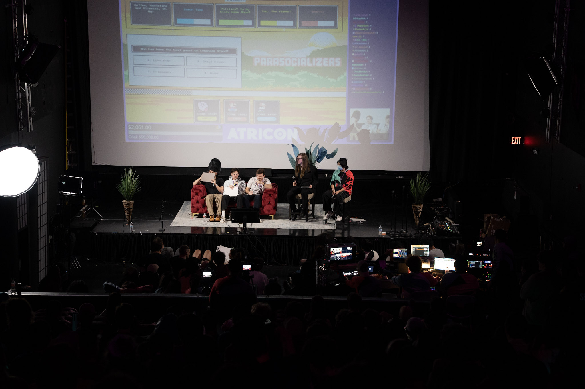

# Parasocializers - A Live Game Show for ATRICON

Parasocializers is a program initially built to support a live game show at ATRICON, a convention that took place in Los Angeles on Nov 22, 2025.

The game allows players to select questions from 5 different category which then get polled in a twitch chat of their choosing. At the end of the alloted time the players are asked to guess the top answer and are given points based on their selected choice.

### Notable Users

The game was played by the hosts of the [Lemonade Stand Podcast](https://www.youtube.com/@LemonadeStandPodcast): Aiden Calvin, Brandon Ewing, and Douglas Wreden.

### Next Steps

- Modularize and fix code.
- Clean up and universalize the software to allow custom games
